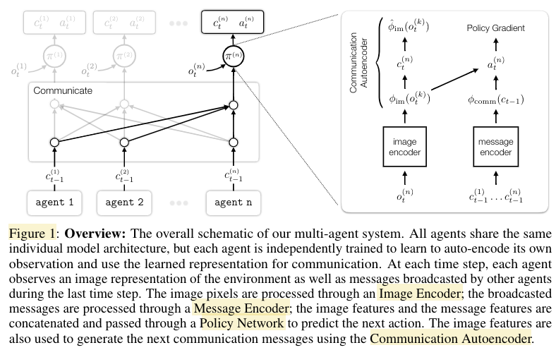

# Implementation of AE_COMM

## AE_COMM

### Model

#### Image Encoder 

The Image Encoder is a convolutional neural network with 4 convolutional layers.
Each layer has a kernel size of 3, stride of 2, padding of 1, and outputs 32 channels. ELU activation
is applied to each convolutional layer. A 2D adaptive average pooling is applied over the output from
convolutional layers. The final output has 32 channels, a height of 3, and a width of 3.

#### Communication Autoencoder 

The Communication Autoencoder takes as input the output from
the Image Encoder. The encoder is a 3-layer MLP with hidden units [128, 64, 32] and ReLU
activation. The decoder is a 3-layer MLP with hidden units [32, 64, 128] and ReLU activation. The
output communication message is a 1D vector of length 10.

#### Message Encoder 

The Message Encoder first projects all input messages using an embedding
layer of size 32, then concatenates and passes the message embeddings through a 3-layer MLP with
hidden units [32, 64, 128] and ReLU activation. Dimension of the output message feature is 128.

#### Policy Network 

Each policy network is consisted of a GRU policy with hidden size 128, a linear
layer mapping GRU outputs to policy logits for the environment action, and a linear layer mapping
GRU outputs to the baseline value function.

## Credits 

- [paper](https://arxiv.org/pdf/2110.15349.pdf)
- [paper website](https://toruowo.github.io/marl-ae-comm/)
- [github | official code of the paper](https://github.com/ToruOwO/marl-ae-comm)
- [github | gym OpenAI](https://github.com/Arseni1919/Learning_Gym_OpenAI#the-environment)
- [gym OpenAI](https://gym.openai.com/envs/#classic_control)
- [github | Minimalistic Gridworld Environment (MiniGrid)](https://github.com/maximecb/gym-minigrid)
- [github | marlgrid](https://github.com/kandouss/marlgrid)
- [matplotlib | Rectangle](https://matplotlib.org/3.5.1/api/_as_gen/matplotlib.patches.Rectangle.html#matplotlib.patches.Rectangle)
- [matplotlib | heatmap](https://matplotlib.org/stable/gallery/images_contours_and_fields/image_annotated_heatmap.html)
- [numpy | rotation of matrix](https://numpy.org/doc/stable/reference/generated/numpy.rot90.html)
- [CS231n Convolutional Neural Networks for Visual Recognition](https://cs231n.github.io/)

### For PPO:

- [openai | MountainCar-v0](https://github.com/openai/gym/wiki/MountainCar-v0)
- [opanai | ppo](https://spinningup.openai.com/en/latest/algorithms/ppo.html)
- [github | my implementation of PPO](https://github.com/Arseni1919/PPO_implementation_variant_2)
- [pytorch | REPRODUCIBILITY](https://pytorch.org/docs/stable/notes/randomness.html)
- [pytorch | PROBABILITY DISTRIBUTIONS](https://pytorch.org/docs/stable/distributions.html#)
- [pytorch | softmax](https://pytorch.org/docs/stable/generated/torch.nn.Softmax.html)
- [pytorch | SAVING AND LOADING MODELS](https://pytorch.org/tutorials/beginner/saving_loading_models.html)
